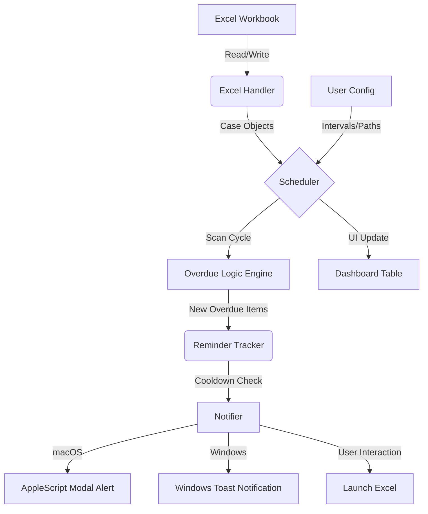

# CaseWatch
*Version 1.0.0-beta*

CaseWatch is a specialized desktop monitoring application designed for district Forensic Science Laboratories (FSL). It automates the tracking of overdue FIR (First Information Report) cases by monitoring an Excel-based registry in the background and providing interactive alerts to staff members.

## Key Features

*   Automated Excel Monitoring: Scans a designated workbook at user-defined intervals without requiring the file to be closed.
*   Intelligent Overdue Detection: Identifies cases that have exceeded the allotted resolution timeframe based on allotment and reporting dates.
*   Visual Highlighting: Automatically colors overdue rows in red and resolved rows in green within the physical Excel file.
*   Interactive Notifications: Provides system-level alerts with direct "Open Excel" shortcuts.
*   Smart Tracking: Maintains a local database to prevent notification spam through intelligent cooldown periods.
*   Data Safety: Performs automatic timestamped backups before any write operation to the workbook.

## Cross-Platform Architecture

CaseWatch is engineered to behave as a native application on both macOS and Windows, adapting its core mechanisms to fit each operating system's specific security and notification models.

### macOS Implementation
*   Notifications: Uses an AppleScript bridge (osascript) to bypass the macOS notification sandbox, delivering unblockable modal alerts directly to the center of the screen.
*   File Launching: Utilizes the system `open` utility to route workbooks to the default spreadsheet handler.
*   Lifecycle: Operates as a background process visible in the Menu Bar; closing the main window minimizes the app to the tray.

### Windows Implementation
*   Notifications: Integrates with the native Windows Toast Notification system.
*   File Launching: Uses the Windows `os.startfile` API for high-performance workbook interaction.
*   Auto-Start: Automatically registers itself with the Windows Registry (`HKEY_CURRENT_USER\Software\Microsoft\Windows\CurrentVersion\Run`) to launch silently upon system boot.

## Tech Stack

*   Language: Python 3.9+
*   GUI Framework: PyQt5
*   Data Processing: Pandas
*   Excel Engine: Openpyxl
*   Styling: QSS (Qt Style Sheets)
*   Architecture: Singleton Configuration, Threaded Notification Dispatchers

## System Architecture



## Installation

1. Clone the repository:
   ```bash
   git clone https://github.com/manasvi2909/CaseWatch.git
   cd CaseWatch
   ```

2. Install dependencies:
   ```bash
   pip install -r requirements.txt
   ```

3. Run the application:
   ```bash
   python3 main.py
   ```

## Configuration

Upon the first launch, the Setup Wizard will guide you through:
1. Selecting the target Excel file.
2. Mapping the column headers (e.g., FIR Number, Date Allotment).
3. Setting the overdue threshold (default is 13 days).
4. Choosing the reminder frequency (e.g., every 30 minutes).

## Excel Parsing & Validation Rules

To prevent data mismatch and ensure accurate tracking, CaseWatch enforces strict, non-destructive validation on row ingestion:

*   **Ingested Rows**: Valid rows containing a valid case allotment date will be read, tracked, and synchronized with the dashboard.
*   **Skipped Rows**:
    *   **Entirely Empty Rows**: Blank spacer rows are automatically ignored and skipped silently.
    *   **Missing Allotment Date**: Any row where the "Date Allotment" column is blank or invalid will be skipped, as this date is crucial to compute overdue thresholds.
    *   **Malformed Date Formats**: Text entries in date fields that cannot be cleanly parsed are bypassed.

*Note: If your workbook contains blank rows or rows missing crucial dates, the dashboard case count will reflect only the verified, valid case records processed. You can consult `logs/casewatch.log` to see if any row was skipped and why.*

## Data Integrity

CaseWatch prioritizes the safety of your laboratory records:
*   Backups: Every time CaseWatch modifies a row's color, it first copies the entire file to the `/backups` folder.
*   Non-Destructive: The app preserves all formulas, charts, and existing formatting within your Excel sheet.
*   File Locks: If the file is open in Excel, CaseWatch uses a retry-backoff algorithm to wait for the file to become available before attempting to write highlights.

## Technical Maintenance

*   Logs: Technical logs are stored in `logs/casewatch.log` for troubleshooting.
*   Settings: Local state is persisted in `config.json`.
*   Tracking: Notification history is managed via `data/reminders.json`.
